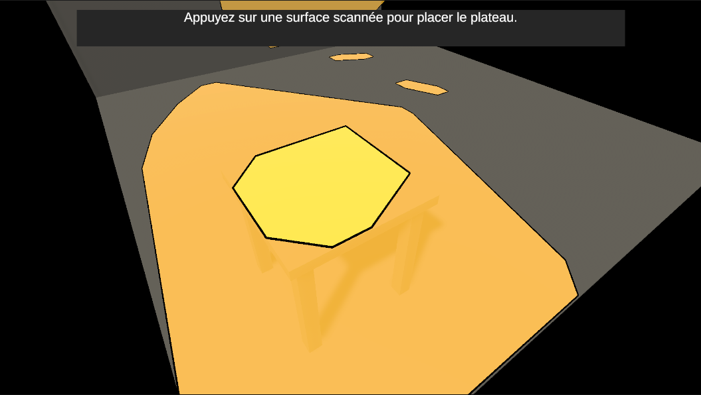
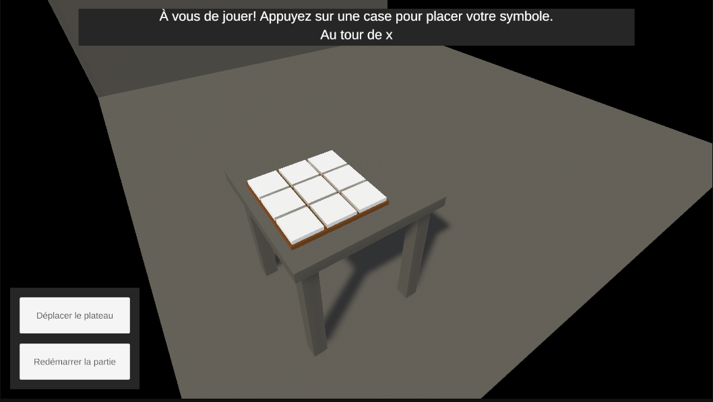
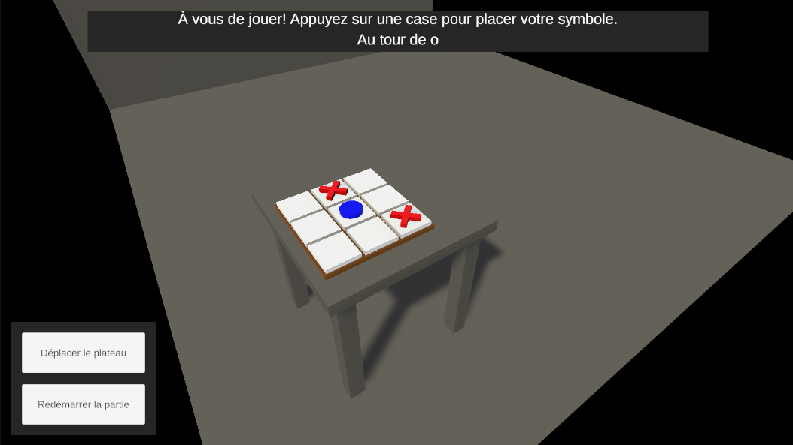
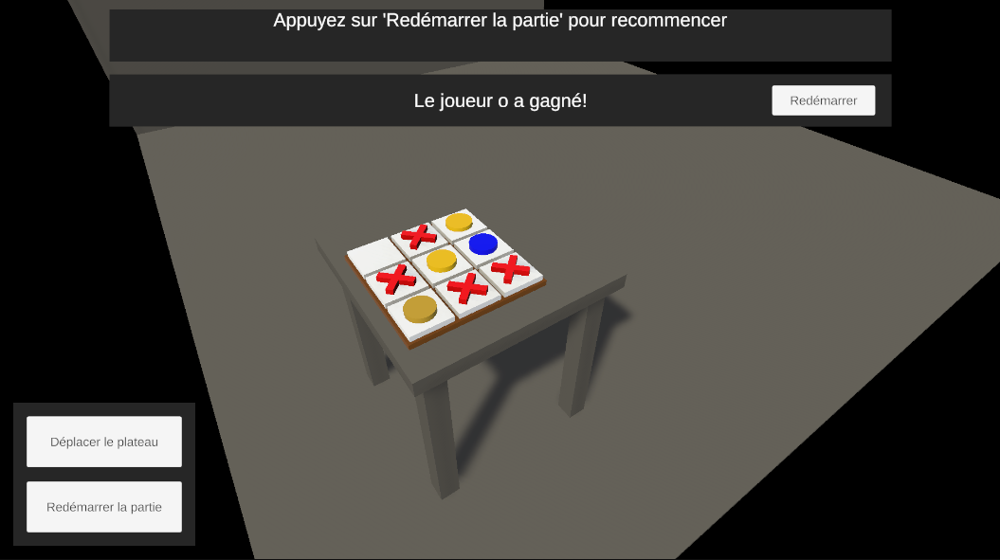
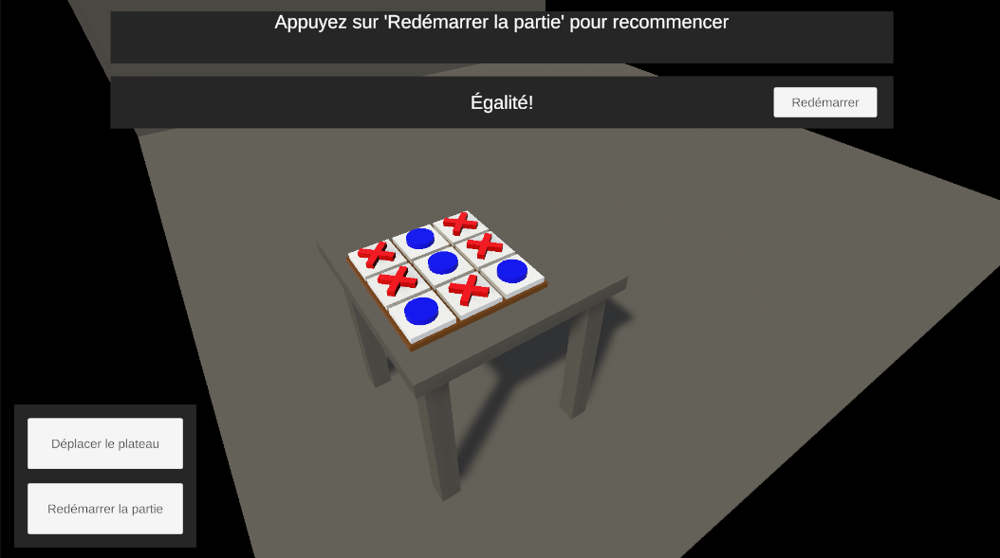

# TicTacToeAR

**Auteur :** William Champagne  
**Date :** 2026-02-07
**Version Unity :** 6.3 LTS (6000.0.5f1)  

---

## Description

TicTacToeAR est une application de réalité augmentée permettant à un utilisateur de placer une planche de TicTacToe dans son environnement.  
Deux joueurs peuvent ensuite jouer à tour de rôle sur cette planche jusqu'à ce qu'un vainqueur soit déterminé ou qu'un match nul soit déclaré.  

(Le projet tourne dans une simulation proposée par Unity)

---

## Fonctionnalités principales

- Placement interactif d’une planche de TicTacToe dans l’environnement AR.
- Gestion du tour des joueurs et du symbole à placer.
- Détection de victoire ou match nul.
- Redémarrage de partie et repositionnement du plateau.

---

## Screenshots

### Scan de l'environnement

> Détection des surfaces AR avant le placement du plateau.

### Nouvelle partie

> L'utilisateur place la planche et la partie est prête à commencer.

### Partie en cours

> Un exemple de jeu en cours avec plusieurs symboles déjà placés.

### Cercle vainqueur

> Illustration d'une victoire avec le symbole cercle.

### Partie nulle

> Exemple d'un match terminé sans vainqueur.

---

## Packages utilisés

- **AR Foundation**
- **Google ARCore XR Plugin**
- **Input System**
- **Universal Render Pipeline (URP)**

---

## Requêtes à l’intelligence artificielle

Les questions posées à l’IA lors du développement du projet :

1. Comment faire en sorte que les éléments de UI ne permettent pas de raycaster au travers? 
2. Comment fonctionnent les ancres en AR et comment les utiliser? 
3. Comment désactiver et réactiver proprement un ARPlaneManager?
